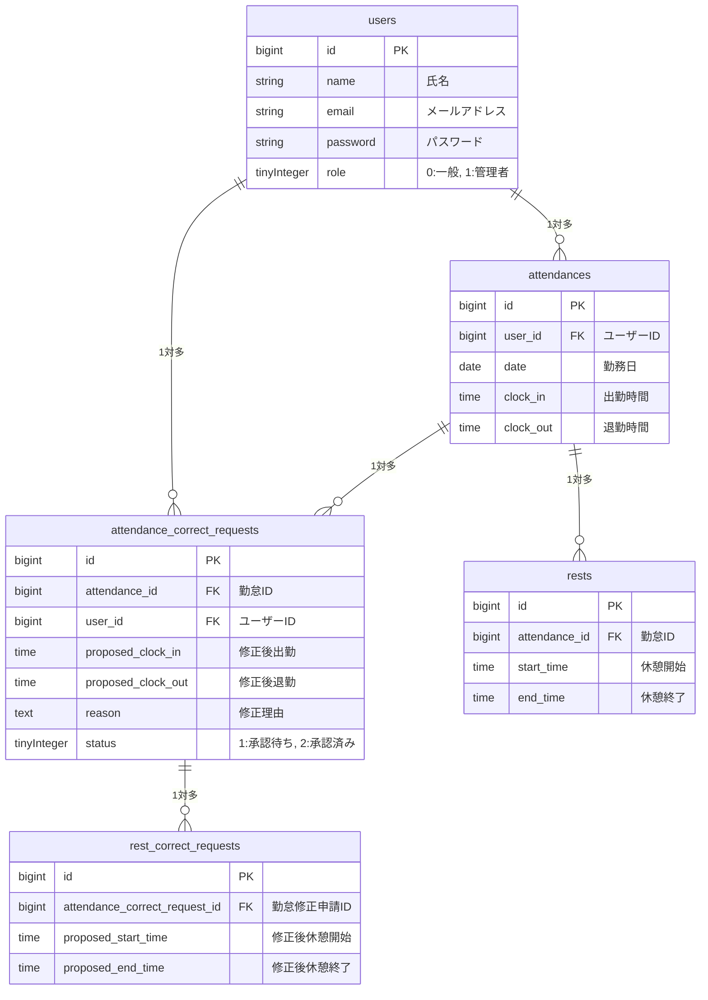

**勤怠管理システム (coachtech-attendance)**

**1. 環境構築の手順**
**Dockerビルド**

git clone https://github.com/mikakoo731y-afk/coachtech-attendance
cd coachtech-attendance
docker-compose up -d --build

コードは注意してご使用ください。

**Laravel環境構築**

docker-compose exec php bash
composer install
cp .env.example .env
chmod -R 777 storage bootstrap/cache

コードは注意してご使用ください。

**データベース構築**

php artisan key:generate
php artisan storage:link
php artisan migrate:fresh --seed

コードは注意してご使用ください。

**2. 開発環境URL**

管理者画面:　http://localhost/admin/login
ログイン画面: http://localhost/login
MailHog: http://localhost:8025

**3. 使用技術（実行環境）**
**言語・フレームワーク**
PHP: 8.2
Laravel: 10.x
Laravel Fortify: 認証機能（ログイン・登録）の実装に使用

**データベース・ミドルウェア**
MySQL: 8.0
Nginx: 最新版

**開発インフラ**
Docker / Docker Compose: 開発環境のコンテナ化

**4. 主要な実装機能**
タイムゾーン設定: アプリケーション・OSレベルで日本時間(JST)に対応
打刻機能: 出勤・退勤・休憩開始・休憩終了の記録
勤怠管理: 日別・利用者別の勤怠情報の表示
バリデーション: FormRequestによる入力チェック
テスト: PHPUnitによる機能テストの実装
データの自動生成: Factory / Seederによるテスト用ユーザーおよび勤怠データの生成
管理者	maill: admin@example.com	pass: password123	
一般　maill: user@example.com	pass: password123

**5. テストの実行**

docker-compose exec php php artisan test

**6.ER図**

